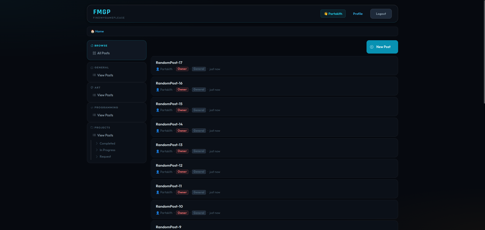
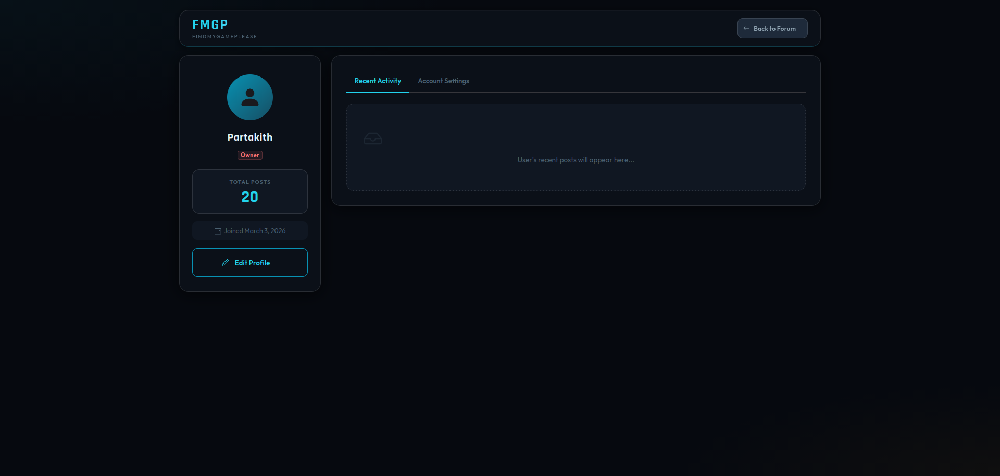
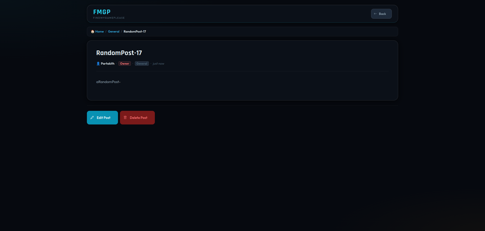
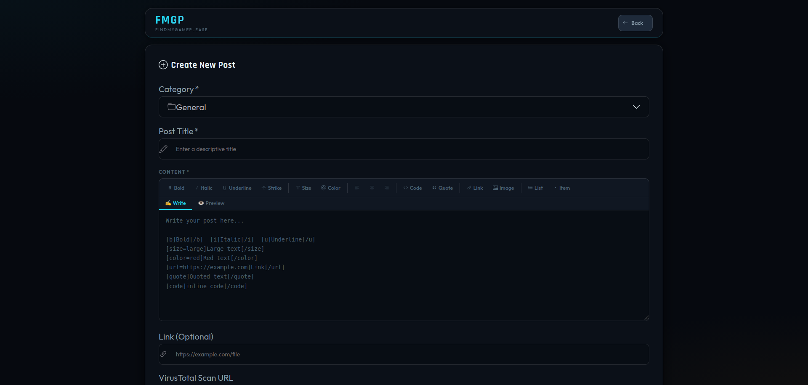
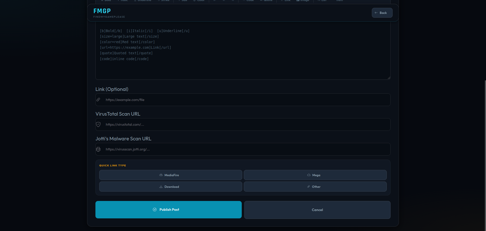
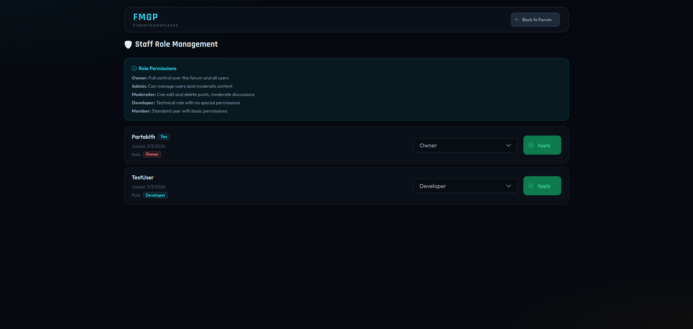

# Forum-Site
A basic frontend and backend working [template] for creating your own forum site. Keeping it simple due to not feeling like writing this out at the moment.












Backend for development node

package.json
```
{
  "name": "forum-backend",
  "version": "1.0.0",
  "type": "module",
  "scripts": {
    "start": "node server.js",
    "dev": "nodemon server.js"
  },
  "dependencies": {
    "express": "^4.18.2",
    "cors": "^2.8.5",
    "sql.js": "^1.10.3",
    "bcrypt": "^5.1.1",
    "express-session": "^1.17.3",
    "passport": "^0.7.0",
    "passport-local": "^1.0.0",
    "dotenv": "^16.3.1"
  },
  "devDependencies": {
    "nodemon": "^3.0.2"
  }
}
// So then start with `npm run dev` or `npm run start` make sure you got all deps.
```

Frontend
```
I was just using python so run,
python3 -m http.server 8080
```

Again not really explaining much at the moment, posting for those that may want to start with an example instead of nothing. 
Use at your own risk, it is recommended you make several updates to fit your needs.
